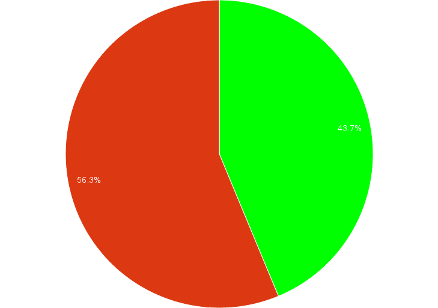
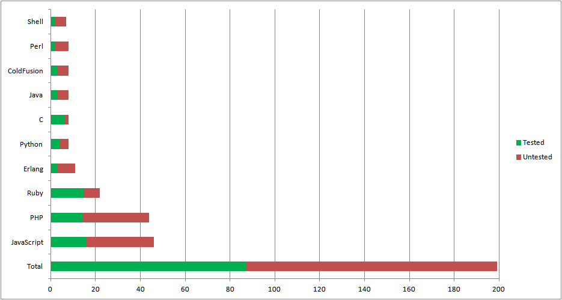

!SLIDE
# Zen and the art of TDD #

!SLIDE
# Matt Steele

* @mattdsteele
* http://matthew-steele.com

!SLIDE
# Unit testing won't help your code

!SLIDE
# \#2 most popular "controversial" opinion

> The only reason to have Unit tests is to make sure that code that already works doesn't break. 
Writing tests first, or writing code to the tests is ridiculous. 

#### <http://programmers.blogoverflow.com/2012/08/20-controversial-programming-opinions/>

!SLIDE center
# Testing is still in the minority

!SLIDE center

!SLIDE
# "I get paid for code that works, not for tests"
## - Kent Beck
#### <http://stackoverflow.com/questions/153234/how-deep-are-your-unit-tests/153565#153565>

!SLIDE
# So why do it?

!SLIDE bullets incremental 

+ Correctness
+ Refactoring
+ Feedback
+ Design
+ Prevents Stupdity

!SLIDE
# 5. Proves code is correct

!SLIDE
#Two Lives

!SLIDE
# 4. Refactoring

!SLIDE smaller
    @@@java

    private int get_state_index(string state) {
     if(state == "AL")
       return 0;
     if(state == "AK")
       return 1;
     if(state == "AZ")
       return 2;
     if(state == "AR")
       return 3;
     if(state == "CA")
       return 4;
     if(state == "CO")
       return 5;
     if(state == "CT")
       return 6;
     if(state == "DE")
       return 7;
     if(state == "FL")
       return 8;
     if(state == "GA")
       return 9;
     if(state == "HI")
       return 10;
     if(state == "ID")
       return 11;
     if(state == "IL")
       return 12;
     if(state == "IN")
       return 13;
     if(state == "IA")
       return 14;
     if(state == "KS")
       return 15;
     if(state == "KY")
       return 16;
     if(state == "LA")
       return 17;
     if(state == "ME")
       return 18;
     if(state == "MD")
       return 19;
     if(state == "MA")
       return 20;
     if(state == "MI")

!SLIDE smaller
    @@@javascript
    var srcData = data;
    if (data.data && data.data.data) {
          data = data.data.data;
    } else if (data.data) {
          data = data.data;
    }
     
     if (!data) {
           return;
     }

!SLIDE smaller
    @@@java
                                                      } // if 26

                                                    } // else if 25

                                                 }  // else if 24

                                              } // else if 23

                                           } // else if 22

                                        } // else if 21

                                     } // else if 20

                                 } // else if 19

                              } // else if 18
                              
                           } // else if 17
                        } //else if 16
                     } // else if 15
                  } // else if 14
               } // else if 13
            } // else if 12
         } // else if 11

!SLIDE

    @@@java
    // drunk, fix later

!SLIDE
# 3. Fast feedback loop

!SLIDE 
<iframe width="1020" height="630" src="http://www.youtube.com/embed/EpLr643jpnY" frameborder="0" allowfullscreen></iframe>

!SLIDE
<iframe width="1020" height="630" src="http://www.youtube.com/embed/37YADF194kU" frameborder="0" allowfullscreen></iframe>

